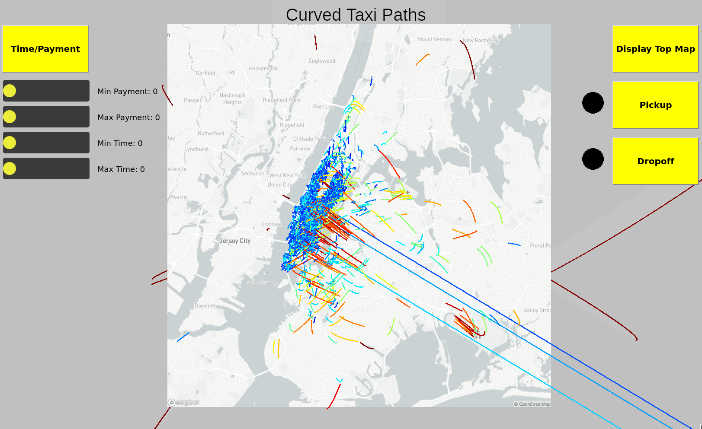
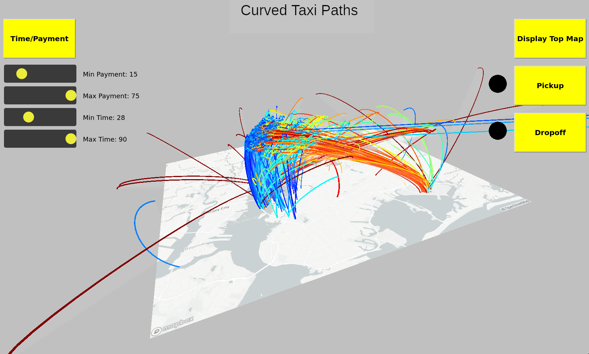
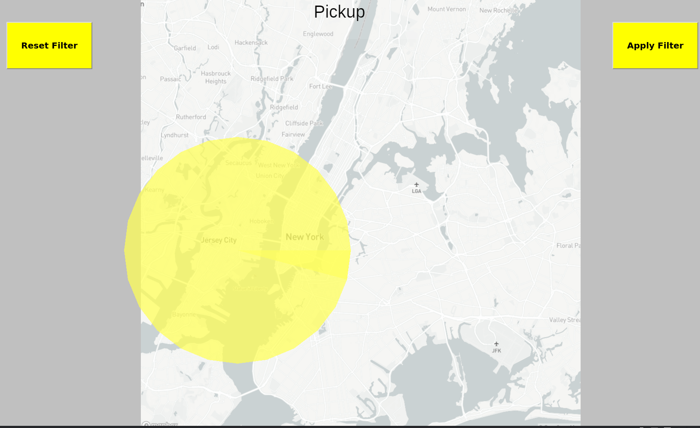
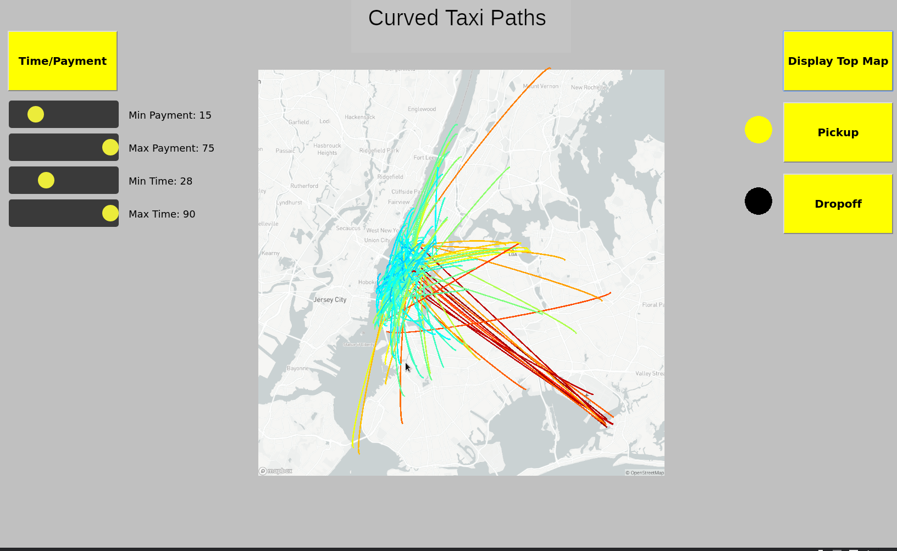

# README
---
## Concept
For my final project in my data visualization class, I decided to create an interactive visualization of New York City taxi data. Because I have never created a Javascript project before, I decided to use this project as an opportunity to do so.
The specifics of my visualization are(best read after running the project):

* The endpoint on the bottom plane is mapped to the pickup location of an entry of the dataset.
* The endpoint on the top plane is mapped to the dropoff.
* The time it took for the ride is mapped to the curveTightness. So in theory, longer rides should be more loopy. But, due to the way I chose the control points, it didn't create the contrast that I had hoped for.
* The payment is mapped to the color of each curve using the jet colormap. Meaning, blue is low, and red is high.

## Running the Project
To run this project in your browser, open up a http server inside this repo. I used nodejs's [http server](https://www.npmjs.com/package/http-server).
Tested on firefox and vivaldi. Vivaldi performs much better.

## Result
I decided to only use 2500 out of a possible 10,000 datapoints so the project would run smoothly. The map of New York City was taken using MapBox's Static API playground.

By adjusting the sliders, you can filter the curves based on the payment and time interval you specify.Note that in order to update, the Max sliders need to be greater than their Min counterparts. Also the times and payments have a cutoff, so that I can utilize a larger range of the spectrum.
The purpose of Top Map Button is so you can see where each datapoint's exact pickup location is, as it is somewhat blocked by top plane.

When you click on the Pickup/Dropoff Button, you will be shown a different display with the map plane and a yellow circle. The purpose of this is to allow the user to also filter pickup/dropoff locations. Click and drag the circle to the pickup/dropoff location you want to see, and use the mouse wheel to increase the location radius

Then, clicking the "Apply Filter" button will filter out the datapoints based on the current setting of the pickup and dropoff circle, as well as the slider's current settings. Notice now that the circle next to the "Pickup" button is now yellow, indicating that we have chosen a filter for the pickup location. To not have any pickup location filter, click the "Reset" button on the Pickup title screen.

