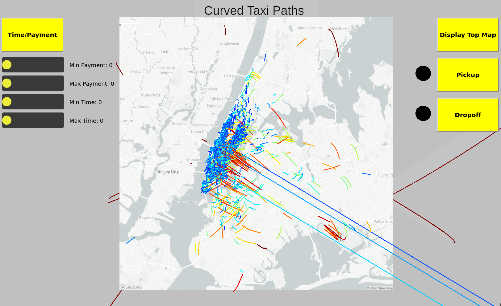

# README
---
## Concept
For my final project, I decided to create an interactive visualization of New York City taxi data. Because I have never created a Javascript project before, I decided to use this project as an opportunity to do so.
The specifics of my visualization are(best read after running the code):

* The endpoint on the bottom plane is mapped to the pickup location of an entry of the dataset.
* The endpoint on the top plane is mapped to the dropoff.
* The time it took for the ride is mapped to the curveTightness. So in theory, longer rides should be more loopy. But, due to the way I chose the control points, it didn't create the contrast that I had hoped for.
* The payment is mapped to the color of each curve using the jet colormap. Meaning, blue is low, and red is high.

## Result
I decided to only use 2500 out of a possible 10,000 datapoints so the project would run smoothly. The map of New York City was taken using MapBox's Static API playground.

